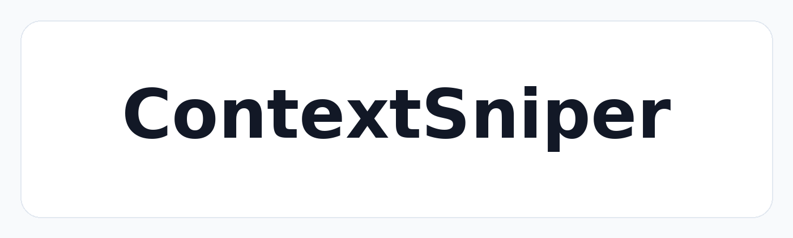

<p align="center">
  
</p>

# ContextSniper

<p align="center">
  <a href="LICENSE"></a>
  <a href="pyproject.toml"></a>
  <a href="pyproject.toml"></a>
  <a href="claude-plugin/"></a>
  <a href="openclaw-plugin/"></a>
  <a href="filter/"></a>
  <a href="agfs/"></a>
</p>

让 Claude Code 或 OpenClaw 通过 ContextSniper 语义代码搜索、长输出过滤和精确替换编辑来理解并修改本地代码库。

[English README](README.md)

## 使用成本降低（REDUCTION）

SWE Lite 验证报告包含 Claude Code 和 OpenClaw 运行的 token 与轮次明细。本次计量选择
`text-embedding-3-large` 作为 embedding 模型。

| Claude Code | OpenClaw |
| --- | --- |
|  |  |

### Claude 单任务平均值

| 指标 | 原版&nbsp;&nbsp;&nbsp;&nbsp; | ContextSniper&nbsp;&nbsp;&nbsp;&nbsp; | ContextSniper Filter&nbsp;&nbsp;&nbsp;&nbsp; | ContextSniper 降低 | ContextSniper Filter 降低 |
| --- | ---: | ---: | ---: | ---: | ---: |
| Input tokens | 1,534,963 | 941,761 | 810,396 | -39% | <strong><font color="#26C889">-47%</font></strong> |
| Output tokens | 16,969 | 11,656 | 11,946 | <strong><font color="#26C889">-31%</font></strong> | -30% |
| Total tokens | 1,551,933 | 953,417 | 822,342 | -39% | <strong><font color="#26C889">-47%</font></strong> |

### OpenClaw 单任务平均值

| 指标 | 原版&nbsp;&nbsp;&nbsp;&nbsp; | ContextSniper&nbsp;&nbsp;&nbsp;&nbsp; | ContextSniper Filter&nbsp;&nbsp;&nbsp;&nbsp; | ContextSniper 降低 | ContextSniper Filter 降低 |
| --- | ---: | ---: | ---: | ---: | ---: |
| Input tokens | 1,309,937 | 769,590 | 622,321 | -41% | <strong><font color="#26C889">-52%</font></strong> |
| Output tokens | 17,439 | 10,399 | 12,982 | <strong><font color="#26C889">-40%</font></strong> | -26% |
| Total tokens | 1,327,377 | 779,989 | 635,303 | -41% | <strong><font color="#26C889">-52%</font></strong> |

## 概览

ContextSniper 提供两个本地插件：

| 宿主 | 插件 | 能力 |
| --- | --- | --- |
| Claude Code | [claude-plugin/](claude-plugin/) | MCP 代码搜索/编辑工具，以及 prompt 策略注入 |
| OpenClaw | [openclaw-plugin/](openclaw-plugin/) | 原生工具、prompt 策略注入，以及 read/exec 过滤 |

两个插件都可以自动启动本地 ContextSniper 后端和 AGFS 服务，并在宿主退出时停止自己启动的服务。


## 快速开始

在全新 checkout 中先准备一次：

```bash
git clone https://github.com/Calluking/ContextSniper.git
cd ContextSniper
./bootstrap.sh
```

导出模型和 embedding 设置：

```bash
export DEEPSEEK_API_KEY="<your-deepseek-key>"
export DEEPSEEK_BASE_URL="https://api.deepseek.com"
export OPENCLAW_MODEL="deepseek/deepseek-v4-flash"
export OPENROUTER_API_KEY="<your-openrouter-key>"
export CONTEXTSNIPER_EMBEDDING_BASE_URL="https://openrouter.ai/api/v1"
export CONTEXTSNIPER_EMBEDDING_MODEL="openai/text-embedding-3-small"
export ANTHROPIC_MODEL="haiku"
```

然后加载设置：

```bash
source setup_env.sh
```

`./bootstrap.sh` 会创建 `.venv`、安装 `requirements.txt` 中的运行时依赖，
并构建 `agfs/build/agfs-server`。完整 SWE-bench 验证是可选的；只有需要
较重的 SWE-bench 依赖时再运行 `./bootstrap.sh --install-swe-deps`。


## 启动 Claude

在你希望 Claude 修改的项目目录中运行：

```bash
cd /path/to/project
claude --plugin-dir "$CONTEXTSNIPER_DIR/claude-plugin"
```

不要传 `--mcp-config`；Claude 插件自带 `.mcp.json`。

## 启动 OpenClaw

在你希望 OpenClaw 修改的项目目录中运行：

```bash
cd /path/to/project
openclaw chat --local
```

## 环境要求

- Python 3.11+
- Go 1.21+
- Claude Code CLI、OpenClaw CLI，或两者都安装并已登录
- OpenAI 兼容的 embedding endpoint 和 API key
- Conda，仅在使用 SWE runner 默认本地验证环境时需要

## 验证

Claude：

```text
/plugin
```

预期状态：

```text
contextsniper Plugin · inline · ✔ enabled
└ contextsniper MCP · ✔ connected
```

OpenClaw：

```bash
openclaw plugins inspect contextsniper --runtime --json
```

运行时输出应包含：

```text
contextsniper_health
contextsniper_index_codebase
contextsniper_search_code
contextsniper_edit_file
```

如果要确认某次运行确实用了 ContextSniper 搜索/过滤：

```bash
latest=$(ls -t ~/.openclaw/agents/*/sessions/*.jsonl | grep -v trajectory | head -1)
rg -n "ContextSniper|FILTER IS TRIGGERED|contextsniper_search_code|contextsniper_edit_file" "$latest"
```

对于 Claude，可以查看当前 Claude debug log 或 `/plugin` 面板。健康的代码任务应出现包含 `search_code` 和 `edit_file` 的 MCP 工具名。


## 配置

本地配置来自 shell 环境或 shell profile；`setup_env.sh` 会导入这些设置并应用仓库默认值。不要提交真实 API key。

常用配置：

| 变量 | 用途 |
| --- | --- |
| `OPENROUTER_API_KEY` | OpenRouter key；会映射为 ContextSniper 内部的 embedding key |
| `CONTEXTSNIPER_EMBEDDING_API_KEY` | 真实语义代码搜索所需的 API key |
| `CONTEXTSNIPER_EMBEDDING_BASE_URL` | OpenAI 兼容 embedding endpoint |
| `CONTEXTSNIPER_EMBEDDING_MODEL` | Embedding 模型名 |
| `PY_BIN` | 可选的插件/后端 Python 覆盖 |
| `CONTEXTSNIPER_FILTER_ENABLED` | read/exec 过滤开关，默认 `1` |
| `CONTEXTSNIPER_INJECT_FILTERING_PROMPT` | 是否注入过滤策略说明 |

`requirements.txt` 已包含 `httpx[socks]`；`setup_env.sh` 也会为
`127.0.0.1`、`localhost` 和 `::1` 设置 `NO_PROXY`/`no_proxy`，避免本地
ContextSniper/AGFS 请求走 HTTP(S)/SOCKS 代理。

## 重要文件

- [bootstrap.sh](bootstrap.sh)：一行命令完成本地准备。
- [setup_env.sh](setup_env.sh)：共用环境加载脚本。
- [claude-plugin/prompts/code_policy_injection.txt](claude-plugin/prompts/code_policy_injection.txt)：Claude 策略 prompt。
- [openclaw-plugin/prompts/code_policy_injection.txt](openclaw-plugin/prompts/code_policy_injection.txt)：OpenClaw 策略 prompt。
- [docs/assets/readme/](docs/assets/readme/)：README 图表。用 `python3 docs/assets/readme/generate_readme_diagrams.py` 重新生成。
- [scripts/SWE/](scripts/SWE/)：SWE Lite runner 和报告。
- [LICENSE](LICENSE)：木兰宽松许可证第 2 版（`MulanPSL-2.0`）。

## SWE Lite Runner

SWE runner 会生成任务提示词，并以非交互方式启动 Claude 或 OpenClaw。六种
runner 模式、运行命令、输出位置和日志检查见
[scripts/SWE/README_CN.md](scripts/SWE/README_CN.md)。

## 许可证

本项目使用木兰宽松许可证第 2 版（`MulanPSL-2.0`）。详见 [LICENSE](LICENSE)。

## 参考

- [AGFS](https://github.com/c4pt0r/agfs)：ContextSniper 在 [agfs/](agfs/) 下内置并构建本地
  AGFS server，并使用 `pyagfs` 处理本地 memory/file-service 操作。
